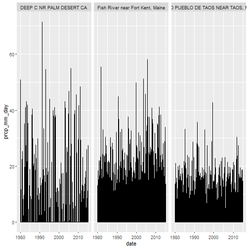
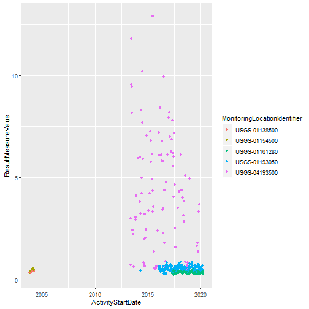

# CamelsQuery

This package ease the processing of NCAR Catchement Attributes and Meteorlogy for Large-sample Studies (CAMELS) data using R using a set of USGS stream gages ([here](https://help.waterdata.usgs.gov/) for more). This package offers a function for downloading the data automatically, are it can be downloaded at the following site:

CAMELS data: https://ral.ucar.edu/solutions/products/camels

## More about this data set

671 small - medium size catchments over the contiguous US (CONUS) minimally impacted by human activities.

2 main type of daily time-series:

- Daily atmospheric forcing (source: Daymet, Maurer and NLDAS)
- Hydrologic reponse (source: USGS daily streamflow)

Attributes data (climatologies):

- topography
- climate
- streamflow
- land cover
- soil
- geology

code creating the data: https://github.com/naddor/camels

## Package installation:

```r 
# install.packages("remotes")
remotes::install_github("brunj7/CamelsQuery")
```

*** 
  
 # Walkthrough
### This guide walks through the how to:  
1. download CAMELS data remotely
2. run and use the `extract_huc_data` function to query and visualize data from the CAMELS dataset
3. use the `get_sample_data` function to get usgs streamgauge data
  
    


##### Load package

```r
library(CamelsQuery)
```
  
##### download data.
Data can be download manually from https://ral.ucar.edu/solutions/products/camels. This package requires that specifically the following be downloaded from there:  
- 1.2	CAMELS time series meteorology, observed flow, meta data (.zip)  
- 2.0	CAMELS Attributes (.zip)   

alternatively the `download_camels()` function can be used to automatically download and unzip the data into a folder of the user's choice


```r
### specify new folder to be created
#~ note: this must be a nonexistant new folder within an already existing folder:
#~ here this is simply creating a camels_data folder within the users home directory

data_dir <- "~/CAMELS_data"

download_camels(data_dir)
```
  
  
  
#### The `extract_huc_data()` function requires three inputs  
* basin directory (basin_dir)  
  + This is the location of the `basin_data_public_v1p2` folder. From this directory you should be able to further navigate to desired daymet mean forcing data folders (labeled 01, 02, 03, etc) via : "~/home/basin_dataset_public_v1p2/basin_mean_forcing/daymet" , and the streamflow folders should be in: "\~/home/basin_dataset_public_v1p2/usgs_streamflow" . This *exact* folder structure is required for the function to work properly (if you used the download function or downloaded from the correct locations mentioned above, this shouldn't be an issue)
* attribute directory (attr_dir)  
  + location of .txt files for data attributes (camels_clim.txt, camels_geol.txt, etc)  
* huc ids (huc8_names)  
  + a vector of 8 digit huc 8 ids to be queried  

  
## Running function  


```r
##~ directories
basin_dir <- "~/CAMELS_data/basin_dataset_public_v1p2"
attr_dir <- "~/CAMELS_data/camels_attributes_v2.0"

##~ list of hucs to query (provided as a vector)
huc8_names <- c("01013500", "08269000", "10259200")

### run function
##~ this returns a named list object with 9 items
data <- extract_huc_data(basin_dir = basin_dir, 
                         attr_dir = attr_dir, 
                         huc8_names = huc8_names)
```
 


## Access output   
  
#### view names of each list item

```r
names(data)
```

```
## [1] "mean_forcing_daymet" "usgs_streamflow"     "camels_clim"        
## [4] "camels_geol"         "camels_hydro"        "camels_name"        
## [7] "camels_soil"         "camels_topo"         "camels_vege"
```
    
### access each item

```r
mean_forcing <- data$mean_forcing_daymet

### an alternative using [[]] syntax: 
##~  mean_forcing <- data[["mean_forcing_daymet"]]
## OR, because this is the first item in the list:
##~  mean_forcing <- data[[1]]

##this returns a tibble/data frame containing the mean forcing data
str(mean_forcing) 
```

```
## Classes 'spec_tbl_df', 'tbl_df', 'tbl' and 'data.frame':	38352 obs. of  12 variables:
##  $ ID          : chr  "01013500" "01013500" "01013500" "01013500" ...
##  $ Year        : num  1980 1980 1980 1980 1980 1980 1980 1980 1980 1980 ...
##  $ Mnth        : chr  "01" "01" "01" "01" ...
##  $ Day         : chr  "01" "02" "03" "04" ...
##  $ Hr          : num  12 12 12 12 12 12 12 12 12 12 ...
##  $ dayl(s)     : num  30173 30253 30344 30408 30413 ...
##  $ prcp(mm/day): num  0 0 0 0 0 0 6.69 3.64 0 0 ...
##  $ srad(W/m2)  : num  153 145 147 146 170 ...
##  $ swe(mm)     : num  0 0 0 0 0 0 0 0 0 0 ...
##  $ tmax(C)     : num  -6.54 -6.18 -9.89 -10.98 -11.29 ...
##  $ tmin(C)     : num  -16.3 -15.2 -18.9 -19.8 -22.2 ...
##  $ vp(Pa)      : num  172 186 138 120 118 ...
```
  
  

```r
## furthermore, we can see that each of the hucs we entered are present
unique(mean_forcing$ID)
```

```
## [1] "01013500" "08269000" "10259200"
```


## visualize

```r
library(ggplot2)
library(lubridate) # for dates
library(janitor) # clean column names

## first, rename huc ID's with location from camels_name, this isn't necessary, but makes for more informative labels
locs <- data[["camels_name"]]
names(locs)
```

```
## [1] "gauge_id"   "huc_02"     "gauge_name"
```

```r
# clean column names
cleaned_forcing <- clean_names(mean_forcing)

## join data (by ID) to bring in gauge names
cleaned_names <- left_join(cleaned_forcing, locs, by = c("id" = "gauge_id"))

### turn year, month, day columns into single "date" column
mean_forcing_date <- cleaned_names %>%
  ## join columns, forcing into year, month, day format
  mutate(date = ymd(paste(year, mnth, day, sep = "-")))

ggplot(mean_forcing_date, aes(date, prcp_mm_day)) +
  geom_line() +
  facet_wrap(~gauge_name)
```




## get WQ data

The `get_sample_data` is a user-friendly wrapper for a function from the USGS's dataRetrieval function to pull water quality data from selected stream gauges

```r
## read in gauges of interest
gauges <- readr::read_csv("~/CAMELS_data/USGS_trial_sites.csv")

### dataRetrieval functions require sites to be named using an "Agency-Site#" format, this code reformats the trial sites csv into this format
#~ eg: "USGS-01073319""
gauges_new <- gauges %>% 
  mutate(renamed_site = paste(SiteAgency, "-", SiteNumber, sep = ""))

site_names <- gauges_new$renamed_site

sample_data <- get_sample_data(site_names)
```

```
## no sample data found for sites: 
##   USGS-01100500 
##   USGS-01100693 
##   USGS-04182950 
##   USGS-04182900 
##   USGS-04182830 
##   USGS-04181120 
##   USGS-04180988
```

```
## Warning in readNWISpCode(pcodes): The following
## pCodes seem mistyped, and no information was returned:
## 92687,93144,92266,92207,92472,92847,92793,92451
```

## visualize

```r
## look at nitrogen species for all sites over time
N_spp <- sample_data %>% 
  filter(CharacteristicName == "Nitrogen, mixed forms (NH3), (NH4), organic, (NO2) and (NO3)")

ggplot(N_spp, aes(x = ActivityStartDate, y = ResultMeasureValue, color = MonitoringLocationIdentifier)) +
  geom_point()
```




